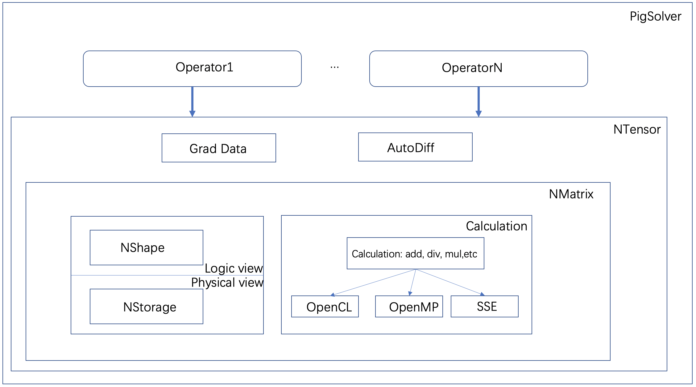

## Pig Solver
This is a simple deep learning framework, which does not rely on a third-party library. If you need to use efficient numerical calculation, openblas is the only third-party library that needs to be installed.



#### Install OpenBLAS
If you want to speed up running , you need to install OpenBLAS, a third-party dependency.
##### 1. Install OpenBLAS on MacOS
``` bash
brew install openblas
```
##### 2. Install OpenBLAS on Linux
In this part, we take the Linux system of Debian  as an example.
``` bash
# 1. Check your gfortran tool.
$ gfortran -v
If prompting command does not exist, you need to install it.
# 2. Install gfortran
$ mkdir your_software_install_path/opt/gfortran/
$ cd your_software_install_path/opt/gfortran/
$ wget https://gfortran.meteodat.ch/download/x86_64/releases/gcc-4.8.5.tar.xz 
$ xz -d gcc-4.8.5.tar.xz
$ tar -xvf gcc-4.8.5.tar
vim ~/.bashrc
export LD_LIBRARY_PATH=your_software_install_path/opt/gfortran/gcc-4.8.5/lib64:your_software_install_path/opt/gfortran/gcc-4.8.5/lib:$LD_LIBRARY_PATH
export PATH=your_software_install_path/opt/gfortran/gcc-4.8.5/bin:$PATH
source ~/.bashrc
# 3. Install OpenBLAS
$ git clone https://github.com/xianyi/OpenBLAS.git
$ cd OpenBLAS
$ make FC=gfortran -j 8
$ sudo make PREFIX=your_software_install_path/opt/OpenBLAS install
```
#### Prepare CMakeLists.txt
##### 1. MacOS
``` bash
cmake_minimum_required(VERSION 3.15)
project(pig_solver)
set(CMAKE_CXX_STANDARD 11)
set(CMAKE_CXX_COMPILER "your_software_install_path/clang++" )
set(CMAKE_C_COMPILER "your_software_install_path/clang")
set(CMAKE_CXX_FLAGS "-fopenmp -mavx -O3")

include_directories("/usr/local/include" 				     "your_software_install_path/llvm/include" "your_software_install_path/opt/OpenBLAS/include")

link_directories("/usr/local/lib" 
"your_software_install_path/llvm/lib" 
"your_software_install_path/opt/OpenBLAS/lib")

add_executable(main main.cpp)
target_link_libraries(main -lomp -lblas -llapack)
```
##### 2. Linux
``` bash
cmake_minimum_required(VERSION 3.15)
set(CMAKE_CXX_STANDARD 11)
set(CMAKE_CXX_FLAGS "-fopenmp -mavx -msse -O3")
set(CMAKE_CXX_COMPILER "your_software_install_path/opt/gfortran/gcc-4.8.5/bin/g++" )
set(CMAKE_C_COMPILER "your_software_install_path/opt/gfortran/gcc-4.8.5/bin/gcc")
project(pig_solver)
set(CMAKE_VERBOSE_MAKEFILE ON)
include_directories("/usr/local/include" "your_software_install_path/opt/gfortran/gcc-4.8.5/include" "your_software_install_path/opt/OpenBLAS/include")
link_directories("/usr/local/lib" "your_software_install_path/opt/gfortran/gcc-4.8.5/lib" "your_software_install_path/opt/gfortran/gcc-4.8.5/gcc-4.8.5/lib64" "your_software_install_path/opt/OpenBLAS/lib")
add_executable(main main.cpp)
target_link_libraries(main libopenblas.a)
```
